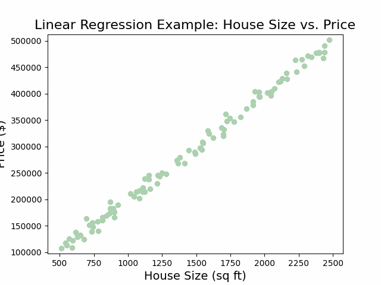
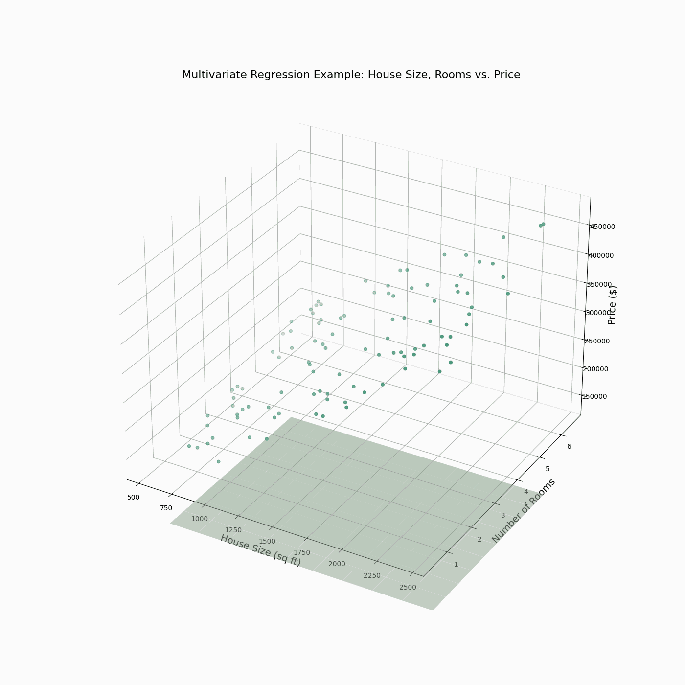
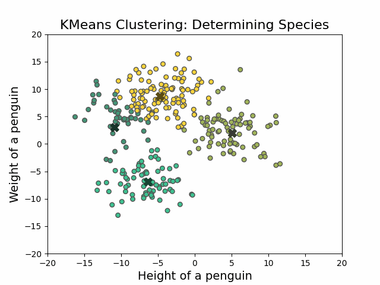
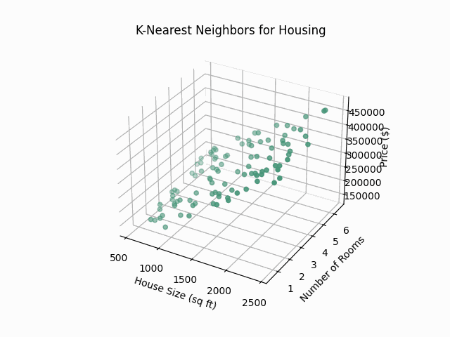

# README.md

This is a repository used to generate plots and other learning materials 
for AI courses, including ML and Data Science.

## Contents

- [Matplotlib & seaborn plots](#matplotlib--seaborn-plots)
- [Code snippets (in presentation)](#code-snippets-rayso)
- [Mermaid diagrams (in presentation)](#mermaid-diagrams)
- [Styling](#styling)
- [Sources](#sources)
- [Plot Showcase](#plot-showcase)

## Matplotlib & Seaborn plots

- `pip install -r requirements.txt`
- `python main.py`: contains a function to render all plots again, 
or a scratchpad to re-render specific plots.

## Code Snippets (ray.so)

The code examples for the slides can be found in ray.so_images. They are, 
of course, made with ray.so.

Settings:
- Theme: meadow
- Background: off
- Margin: 16px
- Languages used: Python, Markdown

This folder also contains code snippets used for the presentation. Some are 
just small snippets, others are fully functional scripts to play around with.

## Mermaid Diagrams

In the `mermaid` folder we store the syntax for the mermaid diagrams in `.md` files and store 
`.svg` and `.png` renders.

## Styling

Everything here uses styling from `colour_reference.md`, which contains the 
CodeCafé colours as well as some supporting colours to complete the palette.

## Sources

### Machine Learning

#### Unsupervised Learning

- [Unsupervised learning algorithms (video)](https://www.youtube.com/watch?v=7Uk-cpOEecI)

#### Reinforcement learning

- [OpenAI Gymnasium](https://github.com/Farama-Foundation/Gymnasium): compare reinforcement learning algorithms.

### Linear Algebra

- Wolfram Alpha offers some insightful demo's in their [demonstrations](https://demonstrations.wolfram.com/topic.html?topic=Linear+Algebra&limit=20) project (broken?).

## Machine Learning Per Domain

Jump to field:

- [Audio Processing & Analysis](#audio-processing--analysis)
- [Biology](#biology)
- [Finance](#finance)
- [Geography](#geography)
- [Image processing](#image-processing)
- [Marketing](#marketing)
- [Natural Language Processing](#natural-language-processing)
- [Network Analysis](#network-analysis)

### Audio Processing & Analysis

- [Librosa](https://librosa.org/doc/latest/index.html): library to work with and transform audio data.
- [SciPy](https://scipy.org/): Offers basic audio signal processing tools, such as Fourier transforms, filtering, and convolution.

### Biology

- [BioPython](https://biopython.org/): biology toolkit for Computational Molecular Biology
- [BioBERT](https://academic.oup.com/bioinformatics/article/36/4/1234/5566506): vector embeddings 
for biological [natural language processing](#natural-language-processing).
- [PlantCV](https://plantcv.org/): Plant Phenotyping Computer Vision

### Finance

- [Top 10 Python for Finance packages](https://www.activestate.com/blog/top-10-python-packages-for-finance-and-financial-modeling/)

### Geography

- [Geopandas](https://geopandas.org/en/stable/): working with geometric data.

### Image Processing

- [OpenCV](https://opencv.org/): face detection and more.
- [Pillow (PIL)](https://pypi.org/project/pillow/): basic image processing like resizing, cropping, and filtering.

### Marketing

Also see [natural language processing](#natural-language-processing), since marketing 
works with this a lot.

### Natural Language Processing

- [BERT](https://en.wikipedia.org/wiki/BERT_(language_model))
- [NLTK (Natural Language ToolKit)](https://www.nltk.org/)
- [Practical Speech Recognition with Python: The Basics](https://www.kdnuggets.com/2019/07/practical-speech-recognition-python-basics.html): 
tutorial on speech recognition in Python (KDNuggets).

### Network Analysis

- [Networkx](https://networkx.org/): network plotting & analysis tool (may require 
a GUI/plotting library to best display the network)

### Robotics

- [ROS (Robot Operating System)](https://www.ros.org/): framework for robot software, integrated with Python for ML.

### Software Development

- [FastAPI](https://fastapi.tiangolo.com/): build API's fast.
- [Flask](https://flask.palletsprojects.com/en/3.0.x/): build web applications with ease.
- [Plotly](https://plotly.com/python/): dashboard library, great for visualization.

## Plot Showcase

Enjoy some cool plots! That need somewhat better styling in the sizing and letters 
and margins.

### Classification Example

