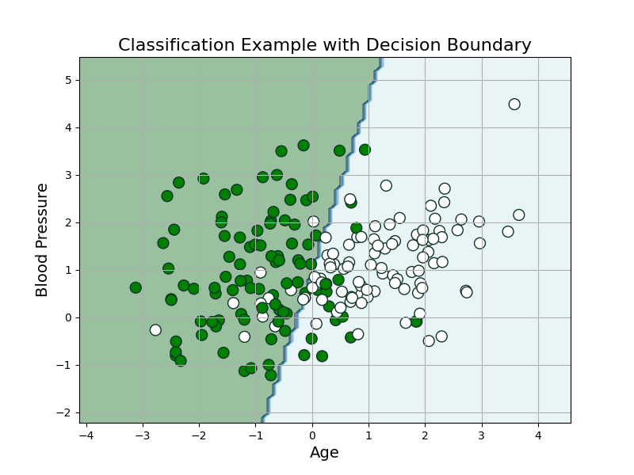
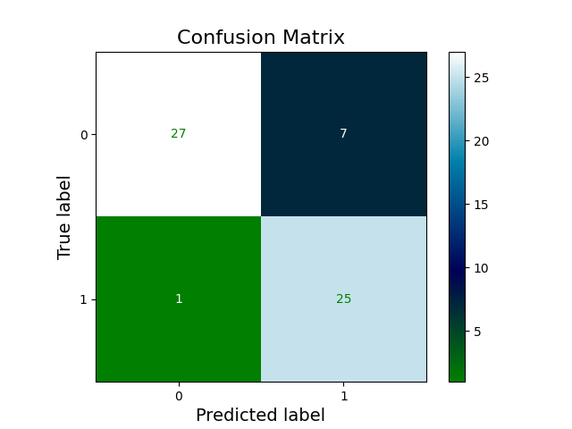
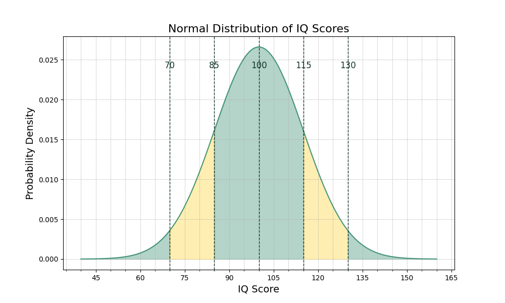

# README.md

This is a repository used to generate plots and other learning materials 
for AI courses, including ML and Data Science.

## Contents

- [Matplotlib & seaborn plots](#matplotlib--seaborn-plots)
- [Code snippets (in presentation)](#code-snippets-rayso)
- [Mermaid diagrams (in presentation)](#mermaid-diagrams)
- [Styling](#styling)
- [Sources](#sources)
- [Plot Showcase](#plot-showcase)

## Matplotlib & Seaborn plots

- `pip install -r requirements.txt`
- `python main.py`: contains a function to render all plots again, 
or a scratchpad to re-render specific plots.

## Code Snippets (ray.so)

The code examples for the slides can be found in ray.so_images. They are, 
of course, made with ray.so.

Settings:
- Theme: meadow
- Background: off
- Margin: 16px
- Languages used: Python, Markdown

This folder also contains code snippets used for the presentation. Some are 
just small snippets, others are fully functional scripts to play around with.

## Mermaid Diagrams

In the `mermaid` folder we store the syntax for the mermaid diagrams in `.md` files and store 
`.svg` and `.png` renders.

## Styling

Everything here uses styling from `colour_reference.md`, which contains the 
CodeCafé colours as well as some supporting colours to complete the palette.

## Sources

### Machine Learning

#### Unsupervised Learning

- [Unsupervised learning algorithms (video)](https://www.youtube.com/watch?v=7Uk-cpOEecI)

### Linear Algebra

- Wolfram Alpha offers some insightful demo's in their [demonstrations](https://demonstrations.wolfram.com/topic.html?topic=Linear+Algebra&limit=20) project (broken?).

## Machine Learning Per Domain

Jump to field:

- [Biology](#biology)
- [Geography](#geography)
- [Natural Language Processing](#natural-language-processing)

### Biology

- [BioBERT](https://academic.oup.com/bioinformatics/article/36/4/1234/5566506)

### Geography

- [Geopandas](https://geopandas.org/en/stable/)

### Natural Language Processing

- [BERT](https://en.wikipedia.org/wiki/BERT_(language_model))
- [NLTK (Natural Language ToolKit)](https://www.nltk.org/)

## Plot Showcase

Enjoy some pretty plots.

### Classification Example

