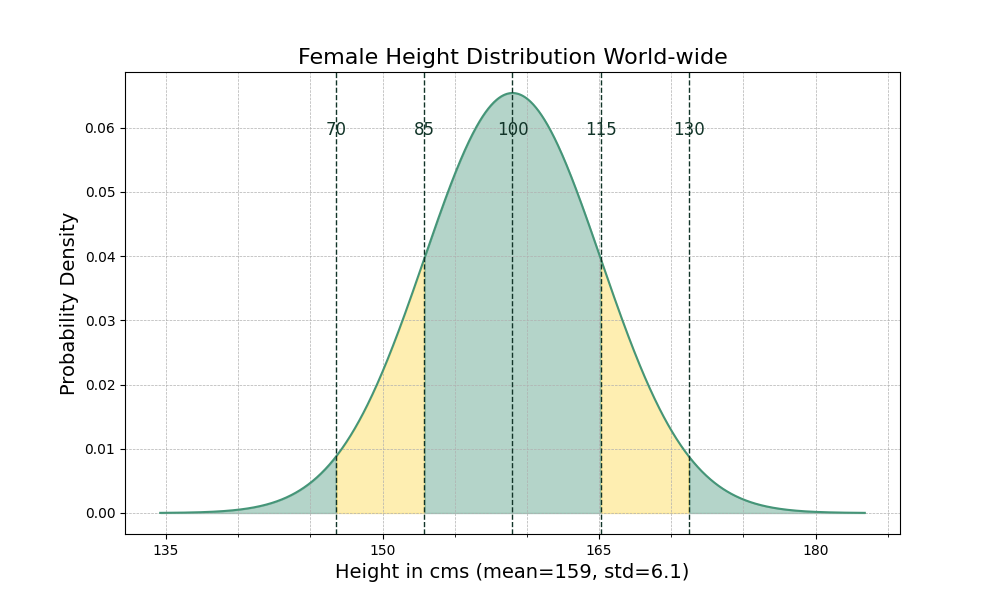

# README.md

## Code Examples for Slides

The code examples for the slides can be found in ray.so_images. They are, 
of course, made with ray.so.

Settings:
- Theme: meadow
- Background: off
- Languages used: Python, Markdown

## Mermaid Diagrams for Slides

In the `mermaid` folder.

## Styling

Everything here uses styling from `colour_reference.md`, which contains the 
CodeCafé colours as well as some supporting colours to complete the palette.

## Sources

### Machine Learning

#### Unsupervised Learning

- [Unsupervised learning algorithms (video)](https://www.youtube.com/watch?v=7Uk-cpOEecI)

### Linear Algebra

- Wolfram Alpha offers some insightful demo's in their [demonstrations](https://demonstrations.wolfram.com/topic.html?topic=Linear+Algebra&limit=20) project (broken?). 

## Look at the pretty plots!

### Classification Example

