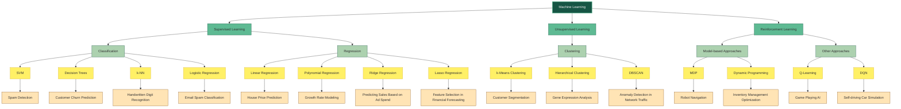

```mermaid
graph TD
    A[Machine Learning]:::main

    A --> B[Supervised Learning]:::section
    A --> C[Unsupervised Learning]:::section
    A --> D[Reinforcement Learning]:::section
    
    %% Supervised Learning Branch
    B --> B1[Classification]:::subsection
    B --> B2[Regression]:::subsection
    
    B1 --> B1a[SVM]:::algorithm
    B1a --> B1a1[Spam Detection]:::example
    
    B1 --> B1b[Decision Trees]:::algorithm
    B1b --> B1b1[Customer Churn Prediction]:::example
    
    B1 --> B1c[k-NN]:::algorithm
    B1c --> B1c1[Handwritten Digit Recognition]:::example
    
    B1 --> B1d[Logistic Regression]:::algorithm
    B1d --> B1d1[Email Spam Classification]:::example
    
    B2 --> B2a[Linear Regression]:::algorithm
    B2a --> B2a1[House Price Prediction]:::example
    
    B2 --> B2b[Polynomial Regression]:::algorithm
    B2b --> B2b1[Growth Rate Modeling]:::example
    
    B2 --> B2c[Ridge Regression]:::algorithm
    B2c --> B2c1[Predicting Sales Based on Ad Spend]:::example
    
    B2 --> B2d[Lasso Regression]:::algorithm
    B2d --> B2d1[Feature Selection in Financial Forecasting]:::example
    
    %% Unsupervised Learning Branch
    C --> C1[Clustering]:::subsection
    
    C1 --> C1a[k-Means Clustering]:::algorithm
    C1a --> C1a1[Customer Segmentation]:::example
    
    C1 --> C1b[Hierarchical Clustering]:::algorithm
    C1b --> C1b1[Gene Expression Analysis]:::example
    
    C1 --> C1c[DBSCAN]:::algorithm
    C1c --> C1c1[Anomaly Detection in Network Traffic]:::example
    
    %% Reinforcement Learning Branch
    D --> D1[Model-based Approaches]:::subsection
    D --> D2[Other Approaches]:::subsection
    
    D1 --> D1a[MDP]:::algorithm
    D1a --> D1a1[Robot Navigation]:::example
    
    D1 --> D1b[Dynamic Programming]:::algorithm
    D1b --> D1b1[Inventory Management Optimization]:::example
    
    D2 --> D2a[Q-Learning]:::algorithm
    D2a --> D2a1[Game Playing AI]:::example
    
    D2 --> D2b[DQN]:::algorithm
    D2b --> D2b1[Self-driving Car Simulation]:::example

    %% Styling
    %% Styling
    classDef main fill:#165544,stroke:#5EBA93,stroke-width:2px,color:#EFEFEF;
    classDef section fill:#5EBA93,stroke:#165544,stroke-width:1px,color:#333333;
    classDef subsection fill:#ACD1AF,stroke:#165544,stroke-width:1px,color:#333333;
    classDef algorithm fill:#FFF066,stroke:#D9B23F,stroke-width:1px,color:#333333;
    classDef example fill:#FFE4B5,stroke:#8A5722,stroke-width:1px,color:#333333;
```