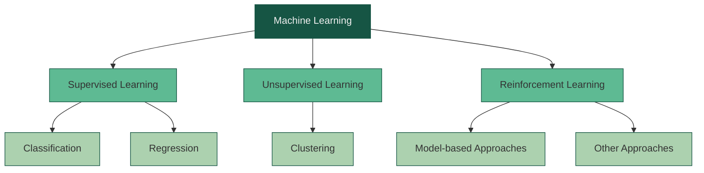

```mermaid
graph TD
    A[Machine Learning]:::main

    A --> B[Supervised Learning]:::section
    A --> C[Unsupervised Learning]:::section
    A --> D[Reinforcement Learning]:::section
    
    %% Supervised Learning Branch
    B --> B1[Classification]:::subsection
    B --> B2[Regression]:::subsection
    
    C --> C1[Clustering]:::subsection
    
    D --> D1[Model-based Approaches]:::subsection
    D --> D2[Other Approaches]:::subsection


    %% Styling
    %% Styling
    classDef main fill:#165544,stroke:#165544,stroke-width:2px,color:#EFEFEF;
    classDef section fill:#5EBA93,stroke:#165544,stroke-width:1px,color:#333333;
    classDef subsection fill:#ACD1AF,stroke:#165544,stroke-width:1px,color:#333333;
    classDef algorithm fill:#FFF066,stroke:#D9B23F,stroke-width:1px,color:#333333;
    classDef example fill:#FFE4B5,stroke:#8A5722,stroke-width:1px,color:#333333;
```